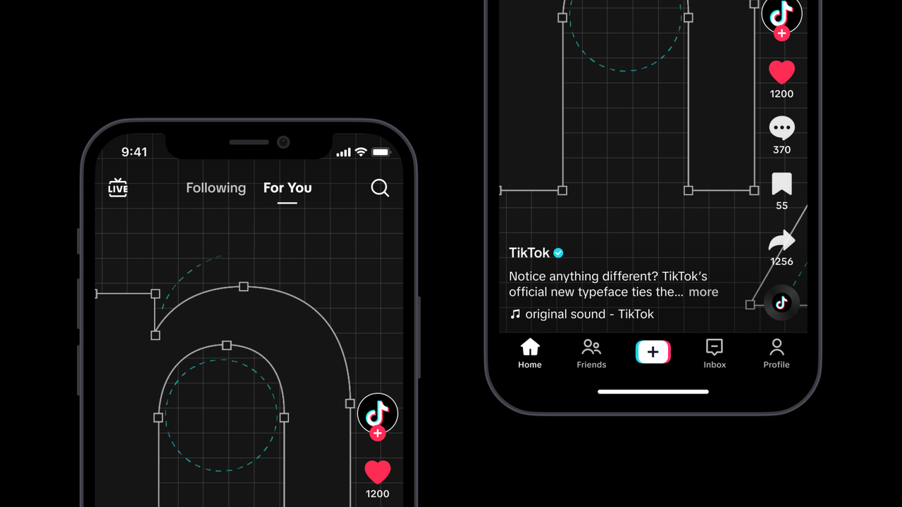
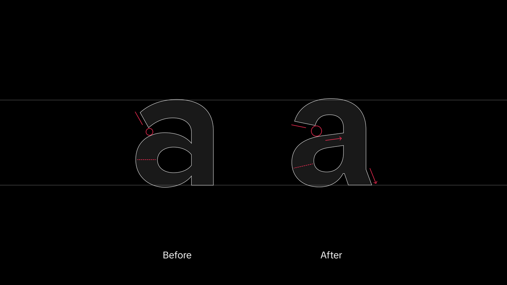
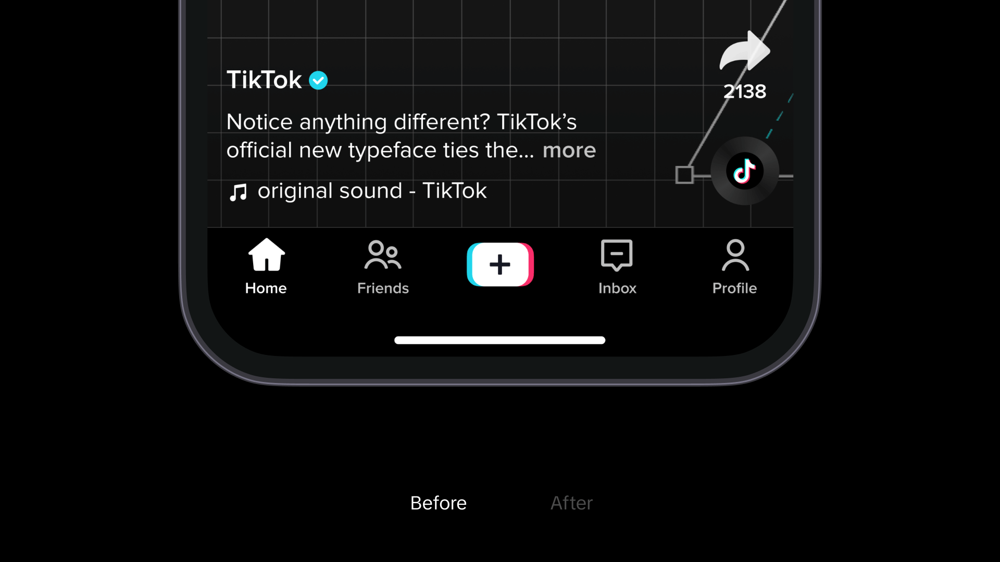

**TikTok** ha creado una nueva tipografía para inspirar la creatividad y brindar alegría a través de experiencias únicas y entretenidas: **TikTok Sans**.

Diseñado en colaboración con **Grilli Type**, **TikTok** afirma que refleja la diversidad de la comunidad global de creadores, visionarios y narradores, desde el entretenimiento hasta la inclusión y la autoexpresión.

Este **tipo de letra versátil** tiene como **objetivo** mejorar la autoexpresión creativa y se implementará a nivel mundial en todos los productos y canales de marca. Se destaca por sus **fuentes simplificadas y distinguidas**, con **aberturas más grandes** y **trazos más claros** para una **mejor legibilidad**.

Ofrece soporte **multilingüe**, incluyendo **inglés, español, portugués, francés, alemán, italiano, indonesio, turco y vietnamita**, con planes de agregar más idiomas en el futuro.

Cuenta con **funciones integradas de accesibilidad** y **protección contra la suplantación de identidad**. Estas funciones ofrecen alternativas estilísticas para letras y números, evitando la falsificación de nombres de usuario.